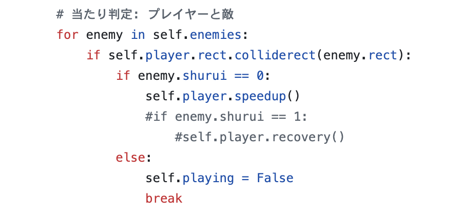
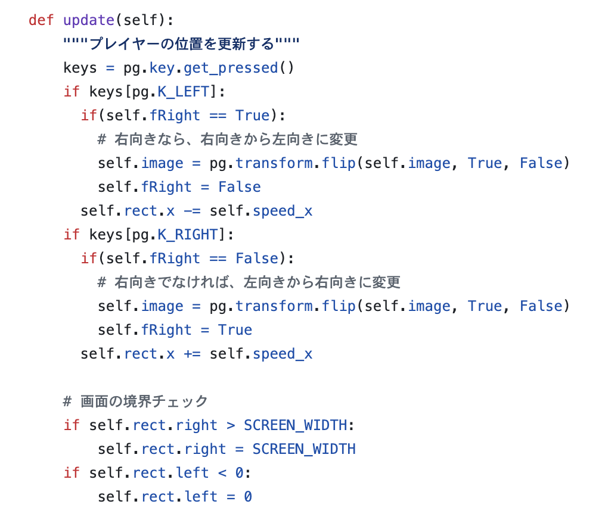
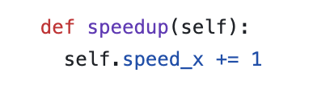

# このプロジェクトについて

このプロジェクトは、pygameを使って作ったシューティングゲームをオブジェクト志向の仕組みを使って作ったものです。

|ファイル名|意味・用途|
|:--|:--|
|main.py|ゲームプログラムのメインの処理。このプログラムが全体の流れを作っています|
|player.py|プレイヤーキャラの処理|
|enemy.py|敵キャラの処理|
|bullet.py|プレイヤーが発射した弾の処理|
|config.py|プログラム内で利用する数値をまとめて定義している設定ファイル|

## オリジナル版からの変更点

このプログラムでは、オリジナル版から以下の点が変更されています。

1. キャラクターの追加、イメージの変更
2. プレイヤーが本のキャラクターに当たると移動速度が上がる

ここでは上記2の変更について説明します。

